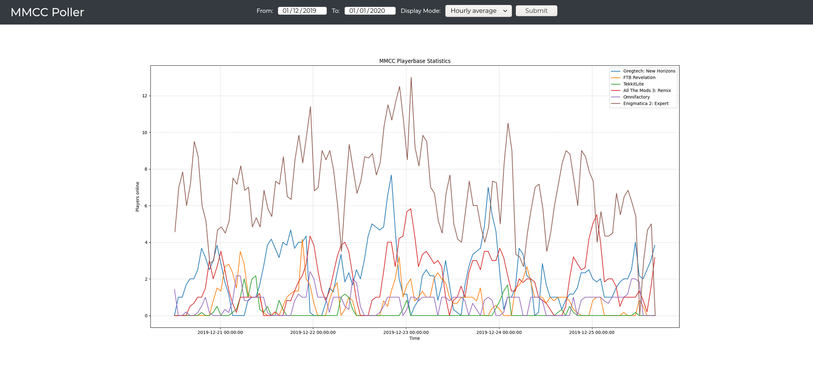

# poller

Minecraft server analytics collector.

Available at <https://poller.moddedminecraft.club/.>

| **Data Collector** |  |                                 |  |  |
|--------------------|--------------------------------------------------------------------------------------------------------------------------------------|------------------------------------------------------------------------------------------|------------------------------------------------------------------------------------------------------------------------|-----------------------------------------------------------------------------------------------------------------------------------------------------|
| **Web App**        |  |  | -                                                                                                                      | -                                                                                                                                                   |

## Deployment

### 1. Dependencies

Before moving on to deploy the `poller` you will need to install the following dependencies:

1. MySQL >=8.0 or MariaDB equivalent

2. Python >=3.7 along with packages specified in `./src/web/requirements.txt`

3. .NET Core >=3.0

Further steps will assume that you have the dependencies already installed.

### 2. Preparing the database

Both the Data Collector and the Web App require a MySQL >=8.0 or MariaDB equivalent database to operate. Follow the steps below to prepare one.

1. Run the `./prepare_database.sql` script to create the MySQL/MariaDB database and tables.

2. Populate the `server` table with servers you want the `poller` to poll. In the `enabled` column `0` means `false` and `1` `true`.

### 3. Building the Data Collector

**This step can be skipped by downloading the latest pre-compiled binaries from [here](https://github.com/ModdedMinecraftClub/poller/releases).**

To build the data collector run the prepared `./src/data_collector/buildLinux.sh` or `./src/data_collector/buildWindows.ps1` script (depending on your OS).

### 4. Deploying the Data Collector

1. If you've built the data collector yourself go to `./src/data_collector/Build`, otherwise go to the folder to which you've unzipped the binaries that you've downloaded from the Releases page.

2. Run the `dotnet ModdedMinecraftClub.Poller.App.dll <Server> <Port> <Username> <Password>` command (replace each command line argument (Server, Port, Username, Password) with your own data).

### 5. Deploying the Web App

// TODO
